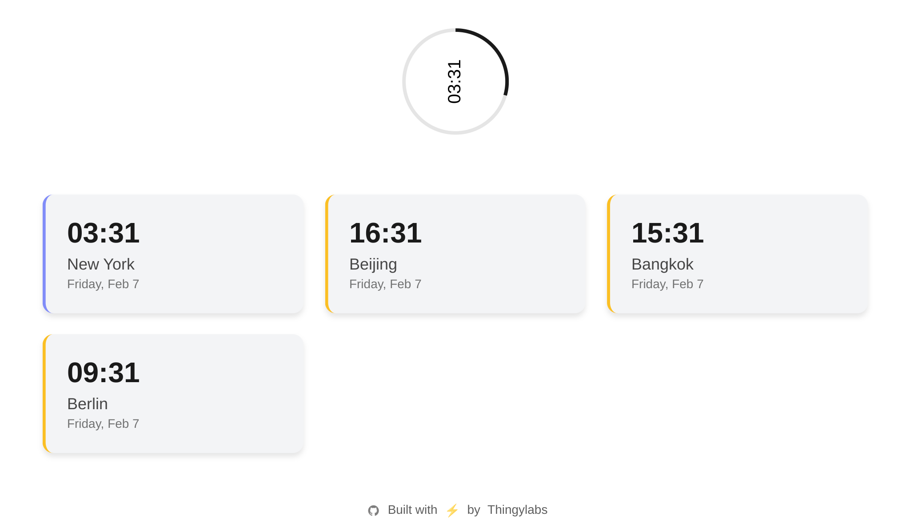
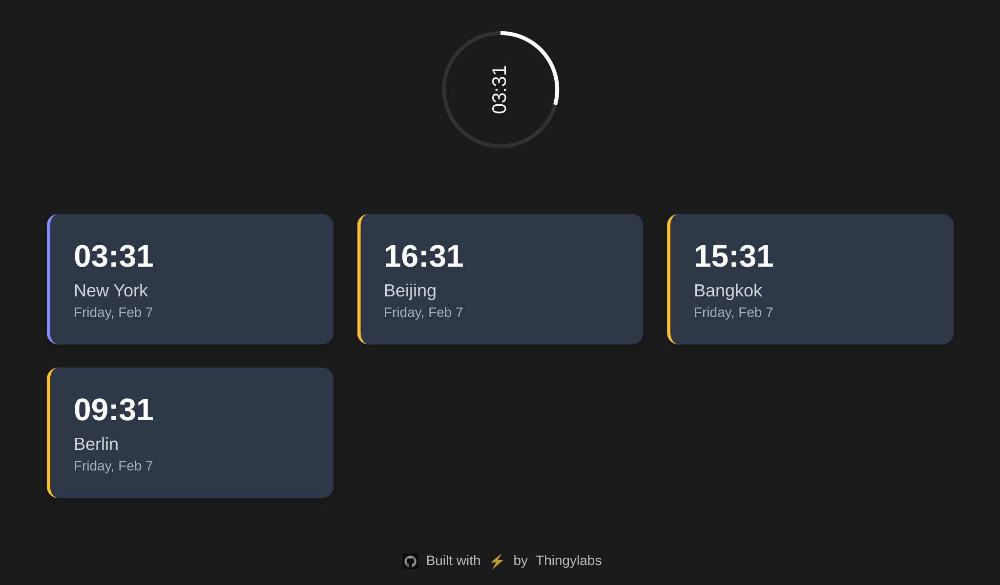

# Time Zones Tab

A beautiful Chrome extension that transforms your new tab page into a clean, minimal timezone dashboard. Built by [Thingylabs](https://github.com/thingylabs).

| default | dark |
| --- | --- |
|  |  |

## Features

- 🌍 Clean visualization of multiple timezones
- 🌓 Automatic dark mode support
- ⭕ Interactive 12-hour progress visualization
- 🎯 Focusable timezones with progress tracking
- ⚡ Zero external runtime dependencies
- 🎨 Smooth transitions and animations
- 📱 Responsive design that works on any screen size

## Installation

### From Source

1. Clone the repository:
```bash
git clone https://github.com/thingylabs/chrome-new-tab-timezones.git
cd chrome-new-tab-timezones
```

2. Load in Chrome:
   - Open Chrome and navigate to `chrome://extensions/`
   - Enable "Developer mode" in the top right
   - Click "Load unpacked"
   - Select the extension directory

### From Chrome Web Store

↩ https://chromewebstore.google.com/detail/time-zones-tab/pgejeagdoldfhmgofefpoiojfagmmhea

## Development

The extension is built with vanilla JavaScript and CSS, focusing on performance and minimal dependencies.

### Project Structure

```
chrome-new-tab-timezones/
├── manifest.json       # Extension manifest
├── newtab.html        # New tab page template
├── newtab.js         # Core functionality
├── icon48.png        # Small icon
└── icon128.png       # Large icon
```

### Customization

To modify the displayed timezones, edit the `TIMEZONES` array in `newtab.js`:

```javascript
const TIMEZONES = [
  { name: 'New York', timezone: 'America/New_York' },
  { name: 'Beijing', timezone: 'Asia/Shanghai' },
  { name: 'Bangkok', timezone: 'Asia/Bangkok' },
  { name: 'Berlin', timezone: 'Europe/Berlin' }
]
```

Use standard [IANA timezone names](https://en.wikipedia.org/wiki/List_of_tz_database_time_zones) for the `timezone` field.

## Contributing

1. Fork the repository
2. Create your feature branch: `git checkout -b feature/amazing-feature`
3. Commit your changes: `git commit -m 'Add amazing feature'`
4. Push to the branch: `git push origin feature/amazing-feature`
5. Open a Pull Request

## License

MIT © [Thingylabs](https://github.com/thingylabs)

## Security

For security concerns, please open an issue or contact us directly.

## Credits

Built with ❤️ by [Thingylabs](https://github.com/thingylabs)

---

<div align="center">
  <sub>Built with ⚡ by Thingylabs</sub>
</div>
